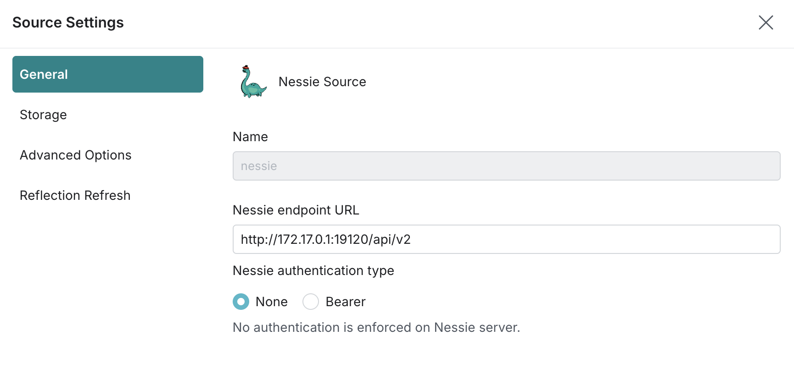
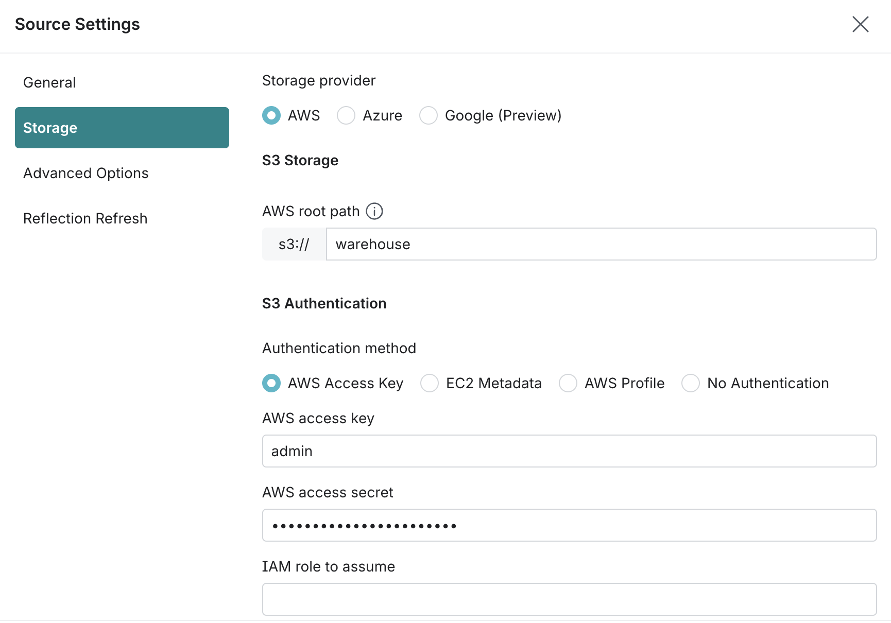
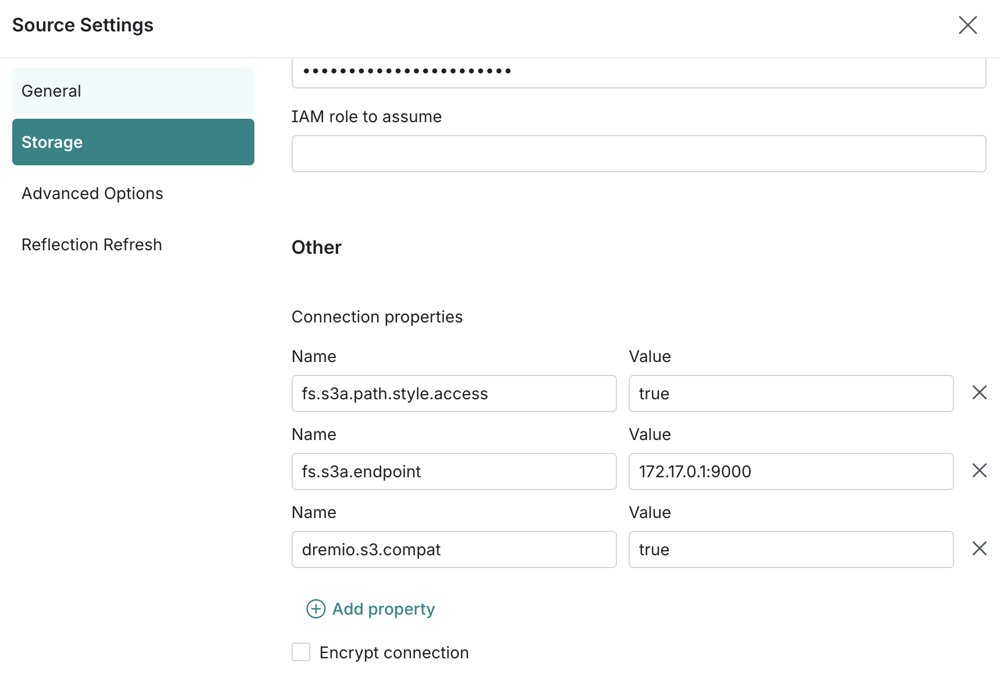

# Booking.com Real-Time Data Workshop
### Apache Flink SQL — Self-Service Lab Guide

---

## The story

You are a data engineer at **Booking.com**. Every second, thousands of travellers around the world are searching for properties, making bookings, and — after their stays — leaving reviews.

Your mission is to build a real-time streaming pipeline that ingests three live event streams, enriches them with property master data, aggregates the results in time windows, and sinks everything into a data warehouse and a data lakehouse ready for dashboarding and analytics.

By the end of this workshop you will have built a pipeline that answers:

- 💰 How much revenue is being generated per city, right now?
- 🚨 Is any city seeing an unusual spike in cancellations?
- ⭐ What is the live review score for each property?
- 🔁 How many users clicked a property and then made a booking?
- 🧊 How do I land enriched booking data into an open lakehouse format for long-term analytics?

---

## Prerequisites

Before running any SQL, confirm the following are running in your environment:

| Component | Purpose | Access |
|---|---|---|
| **Redpanda** | Kafka-compatible broker hosting the event streams | Redpanda Console tab |
| **Ververica** | Apache Flink platform where you run SQL jobs | Ververica tab → SQL |
| **MinIO** | S3-compatible object store — holds the properties CSV and the Iceberg warehouse | CLI tab |
| **Nessie** | Git-like catalog for Iceberg tables — tracks table versions and branches | Internal service |
| **PostgreSQL** | Relational data warehouse receiving aggregated results | CLI tab (`psql`) |
| **Grafana** | Dashboard consuming the warehouse tables | Grafana tab |

> **Credentials** — PostgreSQL: user `root` / password `admin1` · MinIO: access key `admin` / secret `password`

---

## The datasets

Three Kafka topics feed the pipeline, enriched by one reference file.

| Source | Entity          | Asset name                      | Description                                            |
|---|-----------------|---------------------------------|--------------------------------------------------------|
|Kafka topic| Booking events  | `booking.events`                | Every booking creation, cancellation, and modification |
|Kafka topic| Search & clicks | `booking.search_clicks`         | Every property search and click on the platform        |
|Kafka topic| Reviews         | `booking.reviews`               | Guest review scores submitted after checkout           |
|Postgres Table| Properties      | `property_lookup` | Lookup data for 32 properties across 8 cities          |

---

## Lab 1 — Connect to data sources

> **What you will learn:** How to create Flink Dynamic Tables that read from Kafka topics and from a file in object storage. A Dynamic Table behaves like a regular SQL table, but its rows are a continuous stream of events rather than a static snapshot.

### Step 1.1 — Explore the raw events in Redpanda

Before writing any SQL, take a look at the raw data arriving in Kafka.

1. Open the **Redpanda Console** tab
2. Go to **Topics** in the left menu
3. Click on `booking.events` and expand any message to see the JSON payload

You should see fields like `booking_id`, `property_id`, `total_amount`, `genius_level`, and `event_type`. Repeat for `booking.search_clicks` and `booking.reviews`.

---

### Step 1.2 — Create the booking events table

Go to **Ververica → SQL → SQL Scripts** and run the following statement. This creates a Dynamic Table that reads the `booking.events` Kafka topic in real time.

The `WATERMARK` clause tells Flink how to handle late-arriving events — here we allow up to 3 seconds of latency before closing a time window.

```sql
CREATE TABLE booking_stream (
    event_time          TIMESTAMP(3),
    booking_id          STRING,
    property_id         STRING,
    user_id             STRING,
    event_type          STRING,
    channel             STRING,
    room_type           STRING,
    checkin_date        STRING,
    nights              INT,
    num_guests          INT,
    traveler_type       STRING,
    genius_level        INT,
    payment_method      STRING,
    country_of_origin   STRING,
    nightly_rate        FLOAT,
    subtotal            FLOAT,
    genius_discount_pct FLOAT,
    genius_discount_amt FLOAT,
    total_amount        FLOAT,
    currency            STRING,
    is_early_bird       BOOLEAN,
    is_last_minute      BOOLEAN,
    device_type         STRING,
    WATERMARK FOR event_time AS event_time - INTERVAL '3' SECOND
) WITH (
    'connector'                     = 'kafka',
    'properties.bootstrap.servers'  = 'host.minikube.internal:9092',
    'topic'                         = 'booking.events',
    'format'                        = 'json',
    'properties.group.id'           = 'flink-booking-lab',
    'scan.startup.mode'             = 'earliest-offset',
    'properties.auto.offset.reset'  = 'earliest'
);
```

Verify the table is working by running a SELECT — you should see live events streaming in:

```sql
SELECT * FROM booking_stream;
```

> Press the **pause `||` button** besides the result/preview grid to stop the query.

---

### Step 1.3 — Create the search and click events table

Run the following to connect to the second Kafka topic. Notice the `property_id` and `click_action` fields are `NULL` for pure search events — they are only populated when a user clicks on a specific property.

```sql
CREATE TABLE search_click_stream (
    event_time            TIMESTAMP(3),
    session_id            STRING,
    user_id               STRING,
    event_type            STRING,
    destination           STRING,
    checkin_date          STRING,
    checkout_date         STRING,
    nights                INT,
    num_adults            INT,
    num_children          INT,
    device_type           STRING,
    country_of_origin     STRING,
    sort_option           STRING,
    filters_applied       STRING,
    budget_min            FLOAT,
    budget_max            FLOAT,
    property_id           STRING,
    position_in_results   INT,
    click_action          STRING,
    time_on_page_seconds  INT,
    is_repeat_search      BOOLEAN,
    WATERMARK FOR event_time AS event_time - INTERVAL '2' SECOND
) WITH (
    'connector'                     = 'kafka',
    'properties.bootstrap.servers'  = 'host.minikube.internal:9092',
    'topic'                         = 'booking.search_clicks',
    'format'                        = 'json',
    'properties.group.id'           = 'flink-booking-lab',
    'scan.startup.mode'             = 'earliest-offset',
    'properties.auto.offset.reset'  = 'earliest'
);
```

```sql
SELECT * FROM search_click_stream;
```

---

### Step 1.4 — Create the review events table

```sql
CREATE TABLE review_stream (
    event_time            TIMESTAMP(3),
    review_id             STRING,
    booking_id            STRING,
    property_id           STRING,
    user_id               STRING,
    traveler_type         STRING,
    nights_stayed         INT,
    room_type             STRING,
    overall_score         FLOAT,
    cleanliness           FLOAT,
    facilities            FLOAT,
    staff                 FLOAT,
    location              FLOAT,
    value_for_money       FLOAT,
    comfort               FLOAT,
    wifi                  FLOAT,
    review_language       STRING,
    review_text           STRING,
    is_verified_stay      BOOLEAN,
    would_recommend       BOOLEAN,
    response_time_hours   INT,
    WATERMARK FOR event_time AS event_time - INTERVAL '5' SECOND
) WITH (
    'connector'                     = 'kafka',
    'properties.bootstrap.servers'  = 'host.minikube.internal:9092',
    'topic'                         = 'booking.reviews',
    'format'                        = 'json',
    'properties.group.id'           = 'flink-booking-lab',
    'scan.startup.mode'             = 'earliest-offset',
    'properties.auto.offset.reset'  = 'earliest'
);
```

```sql
SELECT * FROM review_stream;
```

---

### Step 1.5 — Create the property lookup table

Unlike the three Kafka tables above, this table reads from a **static CSV file** stored in MinIO (S3-compatible object storage). Flink will load it once and use it as a lookup source for enrichment joins.

```sql
CREATE TABLE master_property (
    property_id      STRING,
    property_name    STRING,
    city             STRING,
    country          STRING,
    property_type    STRING,
    star_rating      INT,
    total_rooms      INT,
    amenities        STRING,
    avg_review_score FLOAT,
    price_tier       STRING,
    latitude         FLOAT,
    longitude        FLOAT,
    PRIMARY KEY (property_id) NOT ENFORCED
) WITH (
  'connector'                 = 'postgres-cdc',
  'hostname'                  = 'host.minikube.internal',
  'port'                      = '5432',
  'username'                  = 'cdc_user',
  'password'                  = 'admin1',
  'database-name'             = 'booking_system',
  'schema-name'               = 'public',
  'table-name'                = 'property_lookup',
  'slot.name'                 = 'flink_cdc_slot',
  'decoding.plugin.name'      = 'pgoutput',
  'debezium.publication.name' = 'all_tables_pub'
);
```

Verify that all 32 properties are loaded correctly:

```sql
SELECT * FROM master_property;
```

## 1.6 Create a Fluss Table

```
CREATE CATALOG fluss WITH (
  'type' = 'fluss',
  'bootstrap.servers' = 'coordinator-server-0.coordinator-server-hs.fluss.svc.cluster.local:9124'
  );

CREATE DATABASE fluss.booking;

CREATE TABLE IF NOT EXISTS fluss.booking.property_lookup (
    property_id      STRING,
    property_name    STRING,
    city             STRING,
    country          STRING,
    property_type    STRING,
    star_rating      INT,
    total_rooms      INT,
    amenities        STRING,
    avg_review_score FLOAT,
    price_tier       STRING,
    latitude         FLOAT,
    longitude        FLOAT,
  PRIMARY KEY (property_id) NOT ENFORCED
) WITH (
    'bucket.num' = '3'
);

```

## Postres CDC to Fluss

```
INSERT INTO fluss.booking.property_lookup
SELECT * FROM master_property;
```

Verify that all 32 properties are loaded correctly, now in the Fluss Primary Key table:

```sql
SELECT * FROM fluss.booking.property_lookup;
```


---

## Lab 2 — Process data in real time

> **What you will learn:** How to enrich a stream with reference data using a JOIN, and how to aggregate events over time using TUMBLE and HOPPING windows. These are the two most important patterns in stream processing.

### Step 2.1 — Enrich booking events with property details

Raw booking events only contain a `property_id`. By joining with `master_property` we can replace the ID with human-readable fields like `property_name`, `city`, and `star_rating`.

This is a **stream–table JOIN**: one side is an infinite stream of events, the other is a bounded lookup table. Flink evaluates the join for each incoming event.

```sql
SELECT
    b.event_time,
    b.booking_id,
    b.event_type,
    b.channel,
    b.total_amount,
    b.genius_level,
    b.country_of_origin,
    p.property_name,
    p.city,
    p.country        AS property_country,
    p.property_type,
    p.star_rating,
    p.price_tier
FROM booking_stream b
JOIN fluss.booking.property_lookup p
  ON b.property_id = p.property_id;
```

Observe that `property_name` and `city` now appear next to the financial fields — the stream has been enriched.

---

### Step 2.2 — Revenue by city (TUMBLE window, 10 seconds)

Now that events are enriched, we can aggregate. The `TUMBLE` function groups events into **fixed, non-overlapping time windows**. Here each window is 10 seconds wide.

Every 10 seconds Flink closes the current window, computes the totals for that period, and emits one result row per city and property type.

The modern Flink SQL syntax wraps the source table in a **Table-Valued Function (TVF)**: `TABLE(TUMBLE(...))`. This replaces the older `GROUP BY TUMBLE(...)` style and gives you `window_start` and `window_end` as first-class columns you can reference directly in the `SELECT` and `GROUP BY`.

```sql
SELECT
    p.city,
    p.property_type,
    window_start,
    COUNT(*)                   AS total_bookings,
    SUM(b.total_amount)        AS revenue_eur,
    AVG(b.total_amount)        AS avg_booking_value,
    SUM(b.genius_discount_amt) AS total_genius_discounts
FROM TABLE(
    TUMBLE(TABLE booking_stream, DESCRIPTOR(event_time), INTERVAL '10' SECONDS)
) AS b
JOIN fluss.booking.property_lookup p ON b.property_id = p.property_id
WHERE b.event_type = 'booking_created'
GROUP BY
    window_start,
    window_end,
    p.city,
    p.property_type;
```

Watch the `window_start` column — it advances in 10-second steps as new windows complete.

---

### Step 2.3 — Cancellation rate alert (HOPPING window, 60-second lookback)

A `HOP` window **slides** forward at a shorter interval than its total size, so each result overlaps with the previous one. Here the window looks back 60 seconds of history but reports a new result every 10 seconds — useful for rolling metrics and alerting.

The `HAVING` clause filters the output to **only show cities where the cancellation rate exceeds 10%**, making this a real operations alert.

For a `HOP` window the TVF takes three arguments: the table, the time descriptor, the **slide interval** (how often a new result is emitted), and the **window size** (how far back it looks).

```sql
SELECT
    p.city,
    window_start,
    COUNT(*)                                              AS total_events,
    SUM(CASE WHEN b.event_type = 'booking_cancelled' THEN 1 ELSE 0 END) AS cancellations,
    ROUND(
        SUM(CASE WHEN b.event_type = 'booking_cancelled' THEN 1.0 ELSE 0.0 END)
        / COUNT(*) * 100, 2
    )                                                     AS cancellation_pct
FROM TABLE(
    HOP(TABLE booking_stream, DESCRIPTOR(event_time), INTERVAL '10' SECONDS, INTERVAL '60' SECONDS)
) AS b
JOIN fluss.booking.property_lookup p ON b.property_id = p.property_id
GROUP BY
    window_start,
    window_end,
    p.city
HAVING
    SUM(CASE WHEN b.event_type = 'booking_cancelled' THEN 1.0 ELSE 0.0 END)
    / COUNT(*) > 0.10;
```

> **Tip:** Remove the `HAVING` clause to see results for all cities, not just the ones above the threshold.

---

### Step 2.4 — Conversion funnel (stream–stream JOIN)

This query joins **two live streams** together: search/click events and booking events. The join condition uses a time range (`BETWEEN ... AND`) to correlate a click with a booking that happened within the following 30 minutes on the same property.

The result shows which clicks eventually converted to a booking — the foundation of a real-time conversion funnel.

```sql
SELECT
    s.session_id,
    s.destination,
    s.device_type,
    s.click_action,
    b.booking_id,
    b.event_type,
    b.total_amount,
    p.property_name,
    p.star_rating
FROM search_click_stream s
JOIN booking_stream b
  ON s.property_id = b.property_id
 AND s.event_time BETWEEN b.event_time - INTERVAL '30' MINUTE
                      AND b.event_time
JOIN fluss.booking.property_lookup p ON b.property_id = p.property_id
WHERE s.event_type   = 'click'
  AND s.click_action = 'start_booking'
  AND b.event_type   = 'booking_created';
```

---

### Step 2.5 — Live review score dashboard (TUMBLE window, 30 seconds)

This query aggregates review scores per city and property type every 30 seconds — giving a continuously updated reputation leaderboard.

```sql
SELECT
    p.city,
    p.property_type,
    p.star_rating,
    window_start,
    COUNT(r.review_id)          AS reviews_received,
    AVG(r.overall_score)        AS avg_overall,
    AVG(r.cleanliness)          AS avg_cleanliness,
    AVG(r.staff)                AS avg_staff,
    AVG(r.value_for_money)      AS avg_value,
    SUM(CASE WHEN r.would_recommend THEN 1 ELSE 0 END) AS recommenders
FROM TABLE(
    TUMBLE(TABLE review_stream, DESCRIPTOR(event_time), INTERVAL '30' SECONDS)
) AS r
JOIN fluss.booking.property_lookup p ON r.property_id = p.property_id
GROUP BY
    window_start,
    window_end,
    p.city,
    p.property_type,
    p.star_rating;
```

---

### Step 2.6 — Bonus: Genius member revenue share

Booking.com's Genius loyalty programme offers discounts at three tiers. This query breaks revenue down by Genius segment so you can see how much revenue — and how many discounts — each tier generates per city.

```sql
SELECT
    p.city,
    window_start,
    CASE
        WHEN b.genius_level = 0 THEN 'Non-Genius'
        WHEN b.genius_level = 1 THEN 'Genius L1'
        WHEN b.genius_level = 2 THEN 'Genius L2'
        ELSE 'Genius L3'
    END                        AS genius_segment,
    COUNT(*)                   AS bookings,
    SUM(b.total_amount)        AS revenue_eur,
    SUM(b.genius_discount_amt) AS discounts_given
FROM TABLE(
    TUMBLE(TABLE booking_stream, DESCRIPTOR(event_time), INTERVAL '30' SECONDS)
) AS b
JOIN fluss.booking.property_lookup p ON b.property_id = p.property_id
WHERE b.event_type = 'booking_created'
GROUP BY
    window_start,
    window_end,
    p.city,
    b.genius_level;
```

---

## Lab 3 — Sink results to PostgreSQL

> **What you will learn:** How to deploy a long-running Flink job that continuously writes aggregated results to a relational database. Once deployed, the job runs indefinitely — every new window of data is automatically computed and persisted. PostgreSQL is used here as the serving layer for Grafana dashboards.

### Step 3.1 — Create the JDBC catalog

A **catalog** in Flink is a connection to an external metadata store. By creating a JDBC catalog pointing to PostgreSQL, Flink can discover the existing tables in the database and use them as write targets.

```sql
CREATE CATALOG dwh WITH (
    'type'             = 'jdbc',
    'base-url'         = 'jdbc:postgresql://host.minikube.internal:5432',
    'default-database' = 'booking_report',
    'username'         = 'root',
    'password'         = 'admin1'
);
```

After running this, you should see **dwh** appear in the Catalog panel on the left side of the SQL editor. Expand it to find `booking_report → city_revenue_report`.

---

### Step 3.2 — Deploy the city revenue report job

This `INSERT INTO` statement is a **continuous query** — unlike a regular INSERT it never finishes. Flink will keep processing new booking events, computing 30-second revenue windows, and writing each result row to PostgreSQL.

```sql
INSERT INTO dwh.booking_report.city_revenue_report
SELECT
    p.city,
    p.country         AS property_country,
    p.property_type,
    b.channel,
    b.traveler_type,
    window_start,
    COUNT(*)                                          AS total_bookings,
    SUM(b.total_amount)                               AS revenue_eur,
    AVG(b.total_amount)                               AS avg_booking_value,
    AVG(b.nights)                                     AS avg_nights,
    SUM(b.genius_discount_amt)                        AS total_genius_discounts,
    SUM(CASE WHEN b.is_early_bird THEN 1 ELSE 0 END)  AS early_bird_count,
    SUM(CASE WHEN b.is_last_minute THEN 1 ELSE 0 END) AS last_minute_count
FROM TABLE(
    TUMBLE(TABLE booking_stream, DESCRIPTOR(event_time), INTERVAL '30' SECONDS)
) AS b
JOIN fluss.booking.property_lookup p ON b.property_id = p.property_id
WHERE b.event_type = 'booking_created'
GROUP BY
    window_start,
    window_end,
    p.city,
    p.country,
    p.property_type,
    b.channel,
    b.traveler_type;
```

When prompted, name the deployment **`city_revenue_job`** and select `default` as the deployment target. Wait for the status to turn **Running** (green).

---

### Step 3.3 — Verify data is landing in PostgreSQL

Open the CLI tab and connect to PostgreSQL:

```bash
psql -p 5432 -d booking_report -U root -W -h host.minikube.internal
```

Run these queries to confirm rows are arriving and growing every 30 seconds:

```sql
SELECT COUNT(*) FROM city_revenue_report;
```

```sql
SELECT city, property_type, revenue_eur, window_start
FROM city_revenue_report
ORDER BY window_start DESC
LIMIT 20;
```

---

## Lab 4 — Sink enriched bookings to Apache Iceberg via Nessie

> **What you will learn:** How to write a real-time stream directly into an **Apache Iceberg** table — an open table format designed for large-scale analytics. Unlike PostgreSQL, Iceberg stores data as Parquet files in object storage (MinIO here), making it queryable by engines like Spark, Trino, and Dremio without any data copying.
>
> **Nessie** acts as the catalog — think of it as Git for data. It tracks every change to the Iceberg table as a versioned commit on a branch, giving you the ability to roll back, audit history, and experiment on feature branches without affecting production data.

### How the stack fits together

```
booking_stream  ──►  Flink  ──►  Nessie catalog  ──►  Iceberg table
                                  (version control)    (Parquet files in MinIO)
```

Nessie holds the table metadata (schema, partition info, snapshot history). The actual data files are Parquet written to `s3a://warehouse/iceberg/` in MinIO. Any query engine that speaks Iceberg can read from the same files without going through Flink.

---

### Step 4.1 — Create the Iceberg sink table

The `CREATE TABLE` below registers an Iceberg table in the Nessie catalog. The `WITH` block contains all the connection details — Nessie's API endpoint, the MinIO credentials, and the S3 bucket path for the warehouse.

> **Note:** This DDL creates the table definition in Flink's session. The physical Iceberg table and its first data files in MinIO are created when the first `INSERT` job runs.

```sql
CREATE TABLE `system`.`default`.`booking_silver` (
    event_time        TIMESTAMP(3),
    booking_id        STRING,
    property_name     STRING,
    city              STRING,
    country           STRING,
    property_type     STRING,
    star_rating       INT,
    price_tier        STRING,
    event_type        STRING,
    channel           STRING,
    room_type         STRING,
    traveler_type     STRING,
    genius_level      INT,
    country_of_origin STRING,
    nights            INT,
    num_guests        INT,
    nightly_rate      DECIMAL(15, 2),
    subtotal          DECIMAL(15, 2),
    genius_discount_amt DECIMAL(15, 2),
    total_amount      DECIMAL(15, 2),
    is_early_bird     BOOLEAN,
    is_last_minute    BOOLEAN,
    device_type       STRING
)
COMMENT 'Enriched booking events — silver layer'
WITH (
    'catalog-database'                  = 'booking',
    'catalog-impl'                      = 'org.apache.iceberg.nessie.NessieCatalog',
    'catalog-name'                      = 'nessie',
    'catalog-table'                     = 'booking_silver',
    'client.region'                     = 'eu-central-1',
    'connector'                         = 'iceberg',
    'hadoop.fs.s3a.access.key'          = 'admin',
    'hadoop.fs.s3a.endpoint'            = 'http://minio.vvp-system.svc:9000',
    'hadoop.fs.s3a.impl'                = 'com.ververica.connectors.iceberg.fs.HadoopFileSystemAdapter',
    'hadoop.fs.s3a.path.style.access'   = 'true',
    'hadoop.fs.s3a.secret.key'          = 'password',
    'io-impl'                           = 'org.apache.iceberg.aws.s3.S3FileIO',
    'nessie.ref'                        = 'main',
    's3.access-key-id'                  = 'admin',
    's3.endpoint'                       = 'http://minio.vvp-system.svc:9000',
    's3.path-style-access'              = 'true',
    's3.region'                         = 'eu-central-1',
    's3.secret-access-key'              = 'password',
    'uri'                               = 'http://nessie.nessie-ns.svc:19120/api/v2',
    'warehouse'                         = 's3a://warehouse/iceberg/'
);
```

**Key `WITH` parameters explained:**

| Parameter | What it does |
|---|---|
| `catalog-impl` | Tells Flink to use the Nessie catalog implementation instead of Hive or Hadoop |
| `nessie.ref` | The Nessie branch to write to — `main` is the default production branch |
| `uri` | Nessie REST API endpoint inside the Kubernetes cluster |
| `warehouse` | Root path in MinIO where Iceberg writes its Parquet data files |
| `io-impl` | Uses S3FileIO so Iceberg reads/writes files via the S3 API rather than HDFS |
| `hadoop.fs.s3a.path.style.access` | Required for MinIO — disables virtual-hosted style S3 addressing |

---

### Step 4.2 — Deploy the enriched booking sink job

This job joins every new booking event with property master data in real time and writes the **fully enriched row** — not an aggregation — directly to Iceberg. This is the **silver layer** of a medallion architecture: raw Kafka events cleaned, joined, and persisted in an open format.

```sql
INSERT INTO `system`.`default`.`booking_silver`
SELECT
    b.event_time,
    b.booking_id,
    p.property_name,
    p.city,
    p.country,
    p.property_type,
    p.star_rating,
    p.price_tier,
    b.event_type,
    b.channel,
    b.room_type,
    b.traveler_type,
    b.genius_level,
    b.country_of_origin,
    b.nights,
    b.num_guests,
    CAST(b.nightly_rate    AS DECIMAL(15, 2)),
    CAST(b.subtotal        AS DECIMAL(15, 2)),
    CAST(b.genius_discount_amt AS DECIMAL(15, 2)),
    CAST(b.total_amount    AS DECIMAL(15, 2)),
    b.is_early_bird,
    b.is_last_minute,
    b.device_type
FROM booking_stream b
JOIN fluss.booking.property_lookup p
  ON b.property_id = p.property_id;
```

When prompted, name the deployment **`booking_silver_iceberg_job`** and select `sql-editor` as the deployment target.

> **Why no windowing here?** Unlike the PostgreSQL sink, this job writes one row per booking event — not an aggregation. The goal is to preserve the full granularity of every transaction so downstream engines (Spark, Trino, Dremio) can run their own aggregations with full flexibility.

---

### Step 4.3 — Verify the Iceberg table in Nessie

Once the job is running, confirm that Nessie has registered the new table and that data files are appearing in MinIO.

**Check the Nessie catalog via the CLI:**

You should see `booking_silver` listed under the `booking` namespace on the `main` branch.

**Check the data files in MinIO UI. Navigate to the `warehouse`bucket and sub-directories.**

Parquet files will appear here as Flink flushes completed checkpoints to object storage. Each file corresponds to a batch of events committed as an Iceberg snapshot.

**Query the table back from Flink to confirm the data is readable:**

```sql
SELECT
    city,
    property_type,
    COUNT(*)               AS total_bookings,
    SUM(total_amount)      AS revenue_eur,
    AVG(total_amount)      AS avg_booking_value
FROM `system`.`default`.`booking_silver`
GROUP BY city, property_type
ORDER BY revenue_eur DESC;
```

---

## Step 4.4 - Setup Dremio

Dremio allows you to query the data and list the table snapshots.

**General tab:**   
Name: nessie
Nessie endpooint URL: http://172.17.0.1:19120/api/v2   
Nessie authentication type: check None




**Storage tab:**   
Storage provider: AWS   
AWS root path: s3://warehouse  
Authentication method: check AWS Access Key  
AWS Access Key: admin   
AWS Access secrete: password    



Other -> Connection properties  
(click `Add Property` to add three new properties)

fs.s3a.path.style.access: true  
fs.s3a.endpoint: 172.17.0.1:9000  
dremio.s3.compat: true  

Disable `Encrypt connection`



Once configure, go to Dremio SQL Runner and execute following queries:   

Preview the Iceberg table data:
```sql
SELECT * from nessie.booking.booking_silver
```

List the Iceberg table snapshots:
```sql

SELECT * FROM TABLE(table_snapshot('nessie.booking.booking_silver'));
```


---

## Lab 5 — Build real-time visualisations

> **What you will learn:** How to connect Grafana to the PostgreSQL data warehouse and build a dashboard that auto-refreshes as new data arrives from the Flink jobs running in Lab 3.

### Step 5.1 — Add a PostgreSQL data source in Grafana

1. Open the **Grafana** tab
2. Click the Grafana logo (top left) → **Connections → Add new connection**
3. Search for **Postgres** and select it
4. Fill in the connection details:

| Field | Value |
|---|---|
| Name | `booking_dwh` |
| Host URL | `host.minikube.internal:5432` |
| Database | `booking_report` |
| Username | `root` |
| Password | `admin1` |
| TLS/SSL | Disabled |
| Version | 15 |

5. Click **Save & Test** — you should see a green confirmation message.

---

### Step 5.2 — Import the dashboard template

1. Click the Grafana logo → **Dashboards**
2. Click **Create Dashboard → Import Dashboard**
3. Upload the JSON template file provided: [booking-revenue-dashboard.json](https://raw.githubusercontent.com/campossalex/apacheflink-labday-1/refs/heads/master/instructions/hotel_booking/assets/booking-revenue-dashboard.json) (right-click then ***Save Link As***) 
4. In the import settings, link the dashboard to the `booking_dwh` data source you just created
5. Click **Import**

The dashboard includes the following panels:

| Panel | Source table | Description |
|---|---|---|
| Revenue by city | `city_revenue_report` | EUR booked per city per 30-second window |
| Bookings by channel | `city_revenue_report` | Channel mix (mobile app, desktop, API…) |
| Early-bird vs last-minute | `city_revenue_report` | Booking lead-time breakdown |
| Genius discount impact | `city_revenue_report` | Total discounts given vs gross revenue |

> Set the **time range** to the last 30 minutes and enable **auto-refresh every 10 seconds** using the controls in the top-right corner of the dashboard.

# Lab 6 — Real-Time AI Pipeline with Flink ML

> **What you will learn:** How to call a large language model directly from a Flink SQL job — no Python, no external microservice, no separate orchestration layer. Every low-score review that arrives on the stream is automatically sent to GPT-4o-mini, and the model's structured response flows back into the pipeline as just another column.

---

## The problem

The reputation monitor you built in Lab 2 tells you *that* a property is receiving low scores. It does not tell you *why*, or what the property team should do about it.

Guests leave free-text reviews. Those reviews contain the answer — but reading thousands of them manually is not feasible in real time. What you need is something that can read each review the moment it arrives, extract the actionable signal, and make it available to the property operations team within seconds of the review being submitted.

That is the pipeline you are about to build.

---

## The architecture

```
review_stream (Kafka)
      │
      │  WHERE overall_score < 6
      │  (filter: only poor reviews)
      ▼
ML_PREDICT()
      │  sends review text + all category scores to GPT-4o-mini
      │  receives: "slow wifi, noisy rooms, unhelpful check-in"
      ▼
enriched output row
      │  review_id, property_id, things_to_improve, latency_ms
      ▼
  sink / dashboard
```

Two SQL statements do all of this. The first defines the AI model once. The second runs as a continuous Flink job that applies it to every matching event.

---

## Step 6.1 — Register the AI model

The `CREATE MODEL` statement teaches Flink about the model: where it lives, what API to call, and what instruction to give it. This only needs to be run once per session — after that, `ai_analyze_review` is available to any query in the session just like a table or a function.

```sql
CREATE MODEL ai_analyze_review
INPUT  (`input`  STRING)
OUTPUT (`output` STRING)
WITH (
  'provider'      = 'openai',
  'task'          = 'classification',
  'api-key'       = '<your-openai-api-key>',
  'model-version' = 'gpt-4o-mini',
  'prompt'        = 'Return three main things to improve based on guest review and score. Respond only with lowercase, one word for improvement, separated by comma.'
);
```

A few things worth noting about the model definition:

| Parameter | What it does |
|---|---|
| `task = classification` | Flink's ML connector treats this as a single-turn prompt–response call. Each row is one API request; the response becomes the `output` column. |
| `prompt` | A system instruction, not the review itself. The actual review text is assembled at query time and passed as `input`. This separation means you can iterate on the prompt without touching the streaming query. |
| `gpt-4o-mini` | Fast and cheap enough to run on every low-score review in real time without meaningful latency or cost impact. |

---

## Step 6.2 — Run the real-time AI inference job

This is the query that connects everything. Read it from the inside out.

### Inner SELECT — build the prompt input

The subquery reads from `review_stream`, filters to reviews with `overall_score < 6`, and uses `CONCAT` to assemble a structured string from all eight numeric score dimensions plus the free-text review and the recommendation flag. This gives the model full context in a single string:

```
Overall: 4.5, Cleanliness: 5.0, Facilities: 4.0, Staff: 3.5,
Location: 7.0, Value for Money: 4.0, Comfort: 5.0, WiFi: 3.0,
Review: The room was fine but the wi-fi kept dropping...,
Would Recommend: false
```

### `ML_PREDICT()` — the inference function

Takes the subquery result as `INPUT`, the registered model as `MODEL`, and `ARGS => DESCRIPTOR(review_summary)` to tell Flink which column to pass as the model's `input` field. Flink handles batching the API calls and merging the `output` column back into the row.

### Outer SELECT — add operational metadata

The `latency_ms` column subtracts the original `event_time` (when the review was submitted) from `CURRENT_TIMESTAMP` (when Flink emits the enriched row). This gives the end-to-end latency of the AI pipeline from review submission to actionable output — a useful operational metric.

```sql
SELECT
  property_id,
  user_id,
  city, 
  country,
  review_text,
  `output`                                                       AS things_to_improve,
  event_time
  FROM ML_PREDICT(
  INPUT => (
    SELECT r.property_id, user_id, city, country, review_text, r.event_time,
      CONCAT(
        'Overall: ', CAST(overall_score AS STRING),
        ', Cleanliness: ', CAST(cleanliness AS STRING),
        ', Facilities: ', CAST(facilities AS STRING),
        ', Staff: ', CAST(staff AS STRING),
        ', Location: ', CAST(location AS STRING),
        ', Value for Money: ', CAST(value_for_money AS STRING),
        ', Comfort: ', CAST(comfort AS STRING),
        ', WiFi: ', CAST(wifi AS STRING),
        ', Review: ', review_text,
        ', Would Recommend: ', CAST(would_recommend AS STRING)
      ) AS review_summary
    FROM review_stream r 
    JOIN master_property p ON r.property_id = p.property_id
    WHERE overall_score < 6
    ),
  MODEL => MODEL ai_analyze_review,
  ARGS  => DESCRIPTOR(review_summary)
) ;
```

---

## What the output looks like

Run this query in the Ververica SQL editor and watch the results appear. Each row arrives within roughly one second of the original review being submitted:

| `review_id` | `property_id` | `things_to_improve` | `latency_ms` |
|---|---|---|---|
| REV-0042917381 | PROP-AMS-003 | slow wifi, noisy street side rooms, limited breakfast options | 1 243 |
| REV-0018823645 | PROP-LON-004 | outdated bathroom fixtures, poor air conditioning, slow check-in | 987 |
| REV-0091134502 | PROP-BCN-003 | small room size, no parking, limited reception hours | 1 105 |

The `things_to_improve` column is already structured — three comma-separated lowercase phrases — because that is what the prompt instructs the model to return. It can be split, grouped, and counted by downstream queries or dashboards without any further parsing.

---

## What just happened

A guest submitted a review with an overall score of 4.5. Within roughly one second:

1. The event arrived on the `booking.reviews` Kafka topic
2. Flink's `review_stream` Dynamic Table consumed it
3. The `WHERE overall_score < 6` filter identified it as requiring attention
4. `ML_PREDICT()` assembled the prompt, called the OpenAI API, and received the structured response
5. The enriched row — with `things_to_improve` and `latency_ms` — was emitted from the query

No batch jobs. No overnight processing. No separate AI service to maintain. The model call is just another operator in the Flink pipeline, handled with the same fault tolerance and exactly-once guarantees as every other step.

---

## Key concepts

| Concept | What it does |
|---|---|
| **`CREATE MODEL`** | Registers an external AI model (OpenAI, Azure, etc.) as a named object in the Flink session |
| **`ML_PREDICT()`** | Table-valued function that calls the model for each input row and returns the output as a new column |
| **`ARGS => DESCRIPTOR(...)`** | Tells `ML_PREDICT` which column in the input subquery maps to the model's `input` field |
| **`latency_ms`** | End-to-end pipeline latency: time from event creation to enriched output, including the AI API call |
| **Prompt as configuration** | The natural language instruction lives in `CREATE MODEL`, not in the query — easy to iterate on without touching the pipeline |


---

## Key concepts recap

| Concept | Used in | What it does |
|---|---|---|
| **Dynamic Table** | Lab 1 | A Flink table backed by a continuous stream rather than static storage |
| **Watermark** | Lab 1 | Tells Flink how long to wait for late events before closing a time window |
| **Stream–table JOIN** | Lab 2.1, 2.2, 2.5, 4.2 | Enriches each stream event with a lookup against reference data |
| **TUMBLE window (TVF)** | Lab 2.2, 2.5 | Fixed-size, non-overlapping windows using `TABLE(TUMBLE(...))` TVF syntax |
| **HOP window (TVF)** | Lab 2.3 | Sliding windows using `TABLE(HOP(...))` — larger lookback, shorter reporting interval |
| **Stream–stream JOIN** | Lab 2.4 | Joins two live streams within a bounded time interval |
| **HAVING on a window** | Lab 2.3 | Filters aggregated window results — used here for threshold alerting |
| **INSERT INTO (sink)** | Lab 3, Lab 4 | Deploys a continuous Flink job that writes results to an external system |
| **JDBC Catalog** | Lab 3 | Lets Flink discover and write to existing PostgreSQL tables |
| **Apache Iceberg** | Lab 4 | Open table format storing data as Parquet files in object storage |
| **Nessie catalog** | Lab 4 | Git-like versioning layer for Iceberg — every write is a trackable commit |
| **Silver layer** | Lab 4 | Enriched, row-level data (not aggregated) ready for downstream analytics engines |


CREATE TABLE master_property (
    property_id     STRING,
    property_name   STRING,
    city            STRING,
    country         STRING,
    property_type   STRING,
    star_rating     INT,
    total_rooms     INT,
    amenities       STRING,
    avg_review_score FLOAT,
    price_tier      STRING,
    latitude        FLOAT,
    longitude       FLOAT,
    PRIMARY KEY (property_id) NOT ENFORCED

) WITH (
  'connector'                 = 'postgres-cdc',
  'hostname'                  = 'host.minikube.internal',
  'port'                      = '5432',
  'username'                  = 'cdc_user',
  'password'                  = 'admin1',
  'database-name'             = 'booking_system',
  'schema-name'               = 'public',
  'table-name'                = 'master_property',
  'slot.name'                 = 'flink_cdc_slot',
  'decoding.plugin.name'      = 'pgoutput',
  'debezium.publication.name' = 'all_tables_pub'
);
